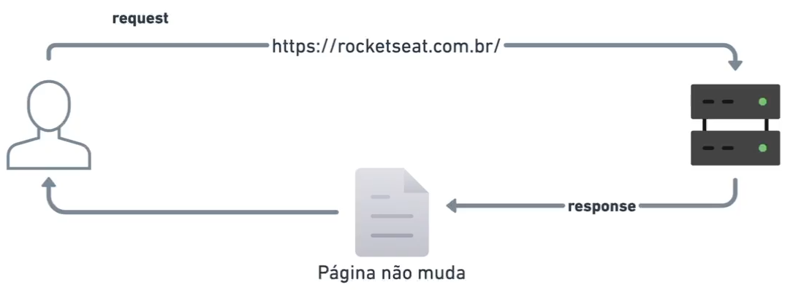
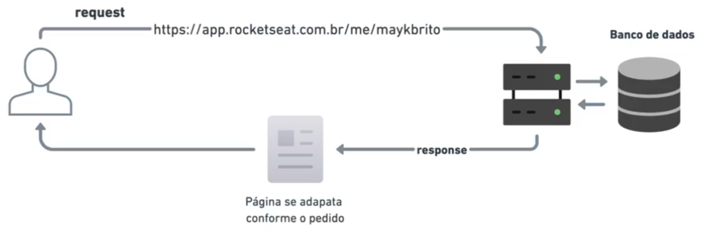
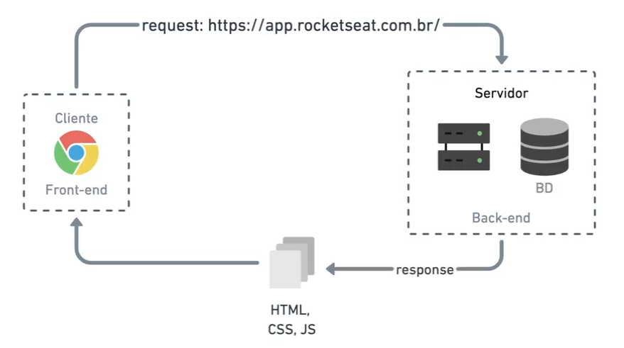
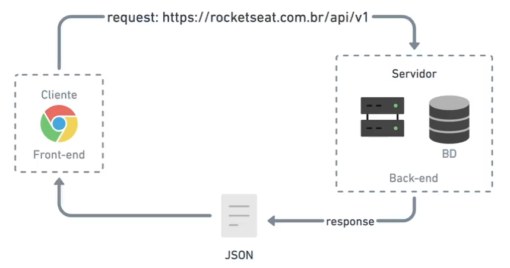

# 1. Primeiros passos

### Como funciona a internet?

- Pesquisar artigos e vídeos de como funciona a internet
- O que é HTTP
- Funcionamento de um browser
- DNS (Domain Name System)
- IP (Internet Protocol)
- Domínio
- Hosting

## Fundamentos da Programação Web

**O que é ser dev e o que é programar**
> Ser um desenvolvedor ou programador significa resolver problemas do mundo real através de linhas de código. Isso requer uma mentalidade voltada para a resolução de problemas e a capacidade de se comunicar com o computador. A programação permite criar aplicativos e soluções para diversas necessidades, como redes sociais, delivery de comida e transporte. O mercado de trabalho para programadores é promissor, pois a programação é essencial para o mundo atual e continuará sendo no futuro. Portanto, aprender a programar é uma habilidade valiosa e cheia de oportunidades.

**Hardware e Software**
> Nesta aula, vamos falar sobre hardware e software. O hardware é a parte física do computador, como teclado, mouse, placas e memórias. Já o software é a parte lógica, que controla o hardware. No Brasil, costumamos chamar o software de programa. Nos Estados Unidos, programa e software são coisas diferentes. O software é o que permite a interação do usuário com o computador, como aplicativos e programas. Na programação web, vamos focar em construir programas e aplicativos para interação na internet. O software é necessário para controlar o hardware e fazer a conexão entre eles. O hardware é tudo que podemos tocar.

**Sistemas Operacionais**
> O Sistema Operacional, também conhecido como SO, é o software mais importante do seu computador. Ele controla o hardware e outros softwares instalados. Existem diferentes sistemas operacionais, como Windows, OSX (Mac) e Linux. Cada um deles funciona de forma diferente, mas todos têm a função de gerenciar as operações do computador. Por exemplo, quando você desliga o computador, o sistema operacional salva algumas coisas no HD. É importante entender como o sistema operacional funciona, pois ele é o cérebro do seu dispositivo. No Brasil, o Windows é mais utilizado, mas muitos programadores preferem o Linux ou o OSX. O sistema operacional é essencial para a construção de aplicativos, programas e tecnologia em geral.

**Arquivos**
> Nesta aula, vamos falar sobre a transição dos arquivos do mundo físico para o mundo virtual. Antigamente, tínhamos fotografias impressas e vídeos em formatos físicos. Agora, no mundo virtual, temos diferentes tipos de arquivos, cada um com sua extensão, como .pdf para documentos, .jpg para imagens, .mp4 para vídeos e .mp3 para áudios. É importante ter o aplicativo correto para abrir cada tipo de arquivo. Além disso, vamos aprender que os arquivos são usados para criar aplicativos e programas. Vamos explorar mais sobre isso ao longo do curso.

**Internet**
> Nesta aula, vamos falar sobre a internet e a web. A internet é uma rede mundial de computadores interligados, que permite a transferência de informações entre diferentes dispositivos. Ela é a espinha dorsal da web, que é como uma teia de aranha, onde os computadores estão interligados. Tudo o que é construído na estrutura da internet, como sites, e-mails e streaming de áudio e vídeo, é considerado um serviço web. A comunicação entre os computadores na internet é feita através de endereços IP, que são convertidos em nomes de domínio pelo sistema DNS. A web permite a troca de arquivos e possibilita que qualquer pessoa, em qualquer lugar do mundo, acesse aplicativos e sites. É uma verdadeira maravilha da tecnologia!

**Front-end vs Back-end**
> Nesta aula, vamos entender o conceito de front-end versus back-end. Front-end refere-se à parte visível e interativa de um site, enquanto back-end é a parte que lida com a lógica e o armazenamento de dados. Usando uma analogia de uma farmácia, o cliente é o front-end, que faz um pedido ao farmacêutico (servidor) e recebe o remédio de volta. O navegador (browser) é o meio pelo qual o cliente faz o pedido ao servidor. Protocolos como IP e HTTP são usados para essa comunicação. O servidor responde com arquivos como HTML, CSS e JavaScript, que são exibidos no navegador. Ter clareza sobre essa distinção tornará as coisas mais fáceis ao trabalhar com desenvolvimento web.

**Tecnologias básicas da Web**
> Nesta aula, vamos abordar as tecnologias básicas da web, que são essenciais para programar na web. No front-end, temos três fundamentais: HTML, que é uma linguagem de marcação de texto para estruturar o conteúdo da página; CSS, que é uma linguagem de estilo para deixar o HTML bonito; e JavaScript, que é uma linguagem de programação para interagir com o site. No back-end, você pode escolher entre várias linguagens de programação, como Node.js, Java, Python, C Sharp, entre outras. Além disso, é importante aprender uma linguagem de consulta para banco de dados, como SQL ou NoSQL, para armazenar e consultar dados de forma segura. Lembre-se de que você não precisa aprender todas essas tecnologias de uma vez, mas sim no momento certo, de acordo com suas necessidades.

**Webpage vs Website**
> Um WebPage é uma página individual na web, composta por arquivos como HTML, CSS e Javascript, acessada através de uma URL no navegador. Já um WebSite é um agrupamento estruturado de várias páginas na web. Por exemplo, ao entrar em um site como rocketcity.com.br, você encontrará a página inicial (home) e outras páginas como catálogo e blog. Cada uma dessas páginas é uma WebPage que leva a outras páginas. Portanto, um WebSite é o conjunto de páginas que formam um site.

**Site Estático vs Site Dinâmico**
- Um site estático é aquele em que as informações não mudam. Quando fazemos um pedido para um servidor, recebemos uma página com HTML, CSS e JavaScript, mas essas informações são definitivas e não mudam.

- Já um site dinâmico é aquele em que as informações se adaptam de acordo com o pedido feito pelo usuário. O servidor busca as informações em um banco de dados e constrói uma página única para cada usuário, com base em suas informações. Assim, cada pessoa vê a página de forma personalizada.

**Aplicativos Web**
> Um aplicativo web, ou web application, é um programa que roda no servidor e é acessado através do navegador. Diferente de um site simples, um aplicativo web é mais complexo e requer o uso de linguagens de programação e bancos de dados. Exemplos de aplicativos web são o Facebook, Gmail, YouTube e o próprio aplicativo web da Rocketseat. Esses aplicativos envolvem programação e banco de dados, e são acessados através de uma URL específica. É importante entender as diferenças entre um site, uma página web e um aplicativo web, pois este último é mais robusto e possui mais requisitos.

**Aplicação Web Tradicional vs Single Page Application**
- Nesta aula, vamos estudar sobre aplicativos web tradicionais e single page applications (SPA). Em uma aplicação web tradicional, quando você faz um pedido para um servidor, recebe uma resposta contendo HTML, CSS e JavaScript.

- Já em um SPA, você recebe esses arquivos uma única vez e, ao interagir com o aplicativo, faz pedidos específicos para atualizar apenas partes da página, recebendo respostas em formatos como JSON. Exemplos de aplicações tradicionais são o WordPress, enquanto o React é uma tecnologia utilizada para criar SPAs. É importante entender as diferenças entre esses dois tipos de aplicação para tomar decisões adequadas ao desenvolver projetos.

**Linguagem de Programação**
> Nesta aula, discutimos sobre linguagem de programação e como ela é usada para dar instruções ao computador. Expliquei o conceito de condicionais, como IF e ELSE, e como elas são usadas para executar diferentes conjuntos de operações com base em determinadas condições. Também mencionei a diferença entre código e programa, onde o código é uma instrução individual e o programa é um conjunto de várias instruções para realizar uma tarefa específica. Falei sobre como o computador entende apenas a linguagem binária, composta por zeros e uns, e como os códigos são traduzidos para essa linguagem. Além disso, mencionei que existem diferentes linguagens de programação, cada uma com sua própria sintaxe e finalidade, e que é importante escolher a linguagem certa para cada objetivo. No geral, a aula abordou os fundamentos da linguagem de programação e como ela é usada para interagir com o computador.