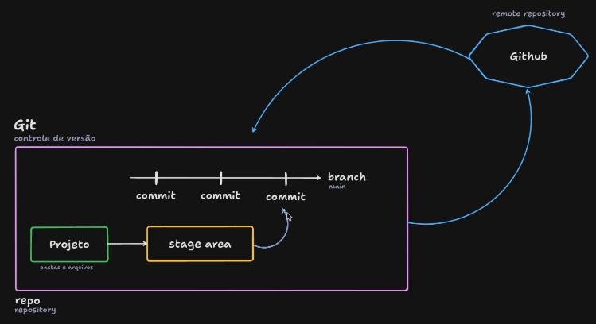

# 2. Git e Github

## Conventional Commits
https://www.conventionalcommits.org/en/v1.0.0/#summary

```
<type>[optional scope]: <description>

[optional body]

[optional footer(s)]
```

### Type

Must be one of the following:

- **build**: Changes that affect the build system or external dependencies (example scopes: gulp, broccoli, npm)
- **ci**: Changes to our CI configuration files and scripts (example scopes: Travis, Circle, BrowserStack, SauceLabs)
- **docs**: Documentation only changes
- **feat**: A new feature
- **fix**: A bug fix
- **perf**: A code change that improves performance
- **refactor**: A code change that neither fixes a bug nor adds a feature
- **style**: Changes that do not affect the meaning of the code (white-space, formatting, missing semi-colons, etc)
- **test**: Adding missing tests or correcting existing tests

---

# Git

## Overview



## Intro

```powershell
git config --global user.name "Thales Amaral"
git config --global user.email "thaleslima225@gmail.com"
```

## Comandos Básicos Para Repositório Local

Nesta aula vamos ver comandos fundamentais para trabalhar com um repositório local no Git.
Esses comandos são essenciais para gerenciar um repositório local no Git.

- `git init` para iniciar um repositório,
- `git status` para verificar alterações,
- `git add` para adicionar arquivos ao stage area,
- `git commit -m “descrição”` para criar um ponto na história com uma descrição
- `git log` para visualizar todos os commits.
- `git branch -M main` Modifica o nome da branch principal de Master para Main


## Iniciando Um Repositório Git

Nesta aula, iniciamos um repositório Git em um projeto, utilizando o comando `git init` no terminal. É importante saber navegar até a pasta do projeto usando o comando "cd" e verificar o caminho com "pwd". Independentemente do sistema operacional, a navegação é essencial. Após executar o comando `git init`, o repositório Git é criado. O processo é simples e fundamental para gerenciar versões do projeto.

```bash
cd C:/Users/thale/Desktop/git-rocketseat
git init
```

## Adicionando Modificações ao Stage Area

O comando `git status` é essencial para verificar as alterações nos arquivos antes do commit.

Utilize `git add` para adicionar arquivos ao StageArea e `git rm --cached` para remover.

Com `git add .`, é possível adicionar todos os arquivos de uma pasta.

Lembre-se de adicionar novamente os arquivos modificados ao StageArea antes de fazer o commit. Esses passos são fundamentais para o versionamento de arquivos no Git.

```bash
$ git status

$ git add texto.txt
$ git rm --cached texto.txt
$ git add .
```

- Depois de modificar o arquivo manualmente

```bash
$ git status
On branch master

No commits yet

Changes to be committed:
    (use "git rm --cached <file>..." to unstage)
        new file:   texto.txt

Changes not staged for commit:
    (use "git add <file>..." to update what will be committed)
    (use "git restore <file>..." to discard changes in working directory)
        modified:   texto.txt
```

## Criando o Primeiro Commit `git commit -m “descrição”`

Nesta aula, aprendemos a criar o primeiro commit de um projeto no Git.

Utilizamos o comando `git status` para verificar o estado do projeto e o `git restore` para restaurar um arquivo ao seu estado anterior.

- `git restore` Restaurar para versão anterior a modificação

```bash
$ git restore texto.txt

thale@Amarals MINGW64 ~/Desktop/git-rocketseat (master)
$ git status
On branch master

No commits yet

Changes to be committed:
    (use "git rm --cached <file>..." to unstage)
        new file:   texto.txt
```

- Commit

```bash
$ git commit -m "initial commit"

thale@Amarals MINGW64 ~/Desktop/git-rocketseat (master)
$ git status
On branch master
nothing to commit, working tree clean

thale@Amarals MINGW64 ~/Desktop/git-rocketseat (master)
$ git commit -m "initial commit"
On branch master
nothing to commit, working tree clean
```

## Alterando e Commitando

Nesta aula, aprendemos a fazer alterações em um arquivo, atualizar as mudanças e criar um novo commit no Git.

Foi destacada a importância de entender o fluxo de trabalho, como adicionar arquivos modificados, criar commits com mensagens descritivas e gerenciar as alterações. O instrutor enfatizou que o Git rastreia automaticamente as modificações nos arquivos, facilitando o processo de versionamento. O controle de versão é essencial para gerenciar e acompanhar as alterações nos arquivos de um projeto.

```bash
# Modifco o arquivo

git status
git add texto.txt
git commit -m "nova linha"
```

## Navegando Pelos Commits

Neste trecho, expliquei como navegar pelos commits usando o comando `git log` para visualizar a história do projeto.

Demonstrei como voltar para um commit anterior usando `git checkout` e a importância de entender o identificador único de cada commit.

Destaquei a possibilidade de criar uma nova branch para trazer modificações de volta ao fluxo de trabalho principal. Finalizei ressaltando a importância de revisitar versões anteriores dos arquivos para entender as mudanças e como retornar ao estado atual do projeto.

- `git log` Histórico

```bash
$ git log
commit 5808b9c1365d3acb792c7f746356c0e759147d60 (HEAD -> master)
Author: Thales Amaral <thaleslima225@gmail.com>
Date:   Thu Sep 12 21:17:51 2024 -0300

    nova linha

commit f272da80ba9e96202d51d3392f833427f40a8e43
Author: Thales Amaral <thaleslima225@gmail.com>
Date:   Thu Sep 12 21:09:42 2024 -0300

    initial commit
```

- `git checkout **<commit_id>**` Checar um commit específico através de uma parte do seu id
    - Ex.: initial commit → commit_id f272da80ba9e96202d51d3392f833427f40a8e43
    - `git checkout f272da80ba`
- Neste “initial commit” o texto.txt não contem a nova linha

```bash
$ git checkout f272da80ba
Note: switching to 'f272da80ba'.

You are in 'detached HEAD' state. You can look around, make experimental
changes and commit them, and you can discard any commits you make in this
state without impacting any branches by switching back to a branch.

If you want to create a new branch to retain commits you create, you may
do so (now or later) by using -c with the switch command. Example:

    git switch -c <new-branch-name>

Or undo this operation with:

    git switch -

Turn off this advice by setting config variable advice.detachedHead to false

HEAD is now at f272da8 initial commit
```

- `git status` e `git log` do commit “initial commit”

```bash
thale@Amarals MINGW64 ~/Desktop/git-rocketseat ((f272da8...))
$ git status
HEAD detached at f272da8
nothing to commit, working tree clean

thale@Amarals MINGW64 ~/Desktop/git-rocketseat ((f272da8...))
$ git log
commit f272da80ba9e96202d51d3392f833427f40a8e43 (HEAD)
Author: Thales Amaral <thaleslima225@gmail.com>
Date:   Thu Sep 12 21:09:42 2024 -0300

    initial commit
```

- `git checkout master` Voltando para o MASTER

```bash
git checkout master
git log
```

## Recuperando Um Arquivo Deletado

Neste trecho, expliquei como recuperar um arquivo deletado em um projeto usando o Git. Ao deletar um arquivo, o Git rastreia essa ação.

- Arquivo deletado: status

```bash
$ git status
On branch master
Changes not staged for commit:
    (use "git add/rm <file>..." to update what will be committed)
    (use "git restore <file>..." to discard changes in working directory)
        deleted:    texto.txt

no changes added to commit (use "git add" and/or "git commit -a")
```

- Add para a Stage Area

```bash
$ git add texto.txt

thale@Amarals MINGW64 ~/Desktop/git-rocketseat (master)
$ git status
On branch master
Changes to be committed:
    (use "git restore --staged <file>..." to unstage)
        deleted:    texto.txt
```

- commit

```bash
git commit -m "deleted texto.txt"
```

- Restaurando o arquivo
- Com o comando  `git checkout <commit_id> -- <nome_do_arquivo>`, é possível recuperar a versão anterior do arquivo. Se desejar remover o arquivo do "stage area", basta avisar ao Git.
- initial commit → f272da80ba9e96202d51d3392f833427f40a8e43

> O arquivo retorna já na Stage area
> 

```bash
git checkout f272da80ba -- texto.txt
```

- Após recuperar o arquivo, é possível criar um novo commit. O Git permite recuperar arquivos deletados com facilidade, desde que o rastreamento dos commits esteja sendo feito corretamente.
- commit

```bash
git commit -m "restored texto.txt"
```

- log
    
    ```bash
    $ git log
    commit e1bec61ffc5e54e7ef92794ebed5e5074d4f5017 (HEAD -> master)
    Author: Thales Amaral <thaleslima225@gmail.com>
    Date:   Thu Sep 12 21:48:33 2024 -0300
    
        restored texto.txt
    
    commit 993a257424829ca03a072434c5a56a9dff6a4253
    Author: Thales Amaral <thaleslima225@gmail.com>
    Date:   Thu Sep 12 21:43:11 2024 -0300
    
        deleted texto.txt
    
    commit 5808b9c1365d3acb792c7f746356c0e759147d60
    Author: Thales Amaral <thaleslima225@gmail.com>
    Date:   Thu Sep 12 21:17:51 2024 -0300
    
        nova linha
    
    commit f272da80ba9e96202d51d3392f833427f40a8e43
    Author: Thales Amaral <thaleslima225@gmail.com>
    Date:   Thu Sep 12 21:09:42 2024 -0300
    
        initial commit
    ```
    
- Se Deletar sem Add para Stage area
- Basta utilizar o `git restore`

```bash
git restore texto.txt
```

---

# Github

## Conectando Repositório Local Com Repositório Remoto

Neste vídeo, aprendemos a conectar um repositório local com um repositório remoto no GitHub. É explicado como criar um novo repositório, a importância de deixá-lo público ou privado, a função do README, gitignore e licença, e como adicionar arquivos ao repositório remoto. São fornecidas instruções passo a passo para realizar essas ações, incluindo a criação de um README.md, o primeiro commit e o push para o repositório remoto. O processo é descrito de forma simples e direta, facilitando a conexão entre o repositório local e remoto.

## Navegando Pelos Commits Através Da Interface Do Github (`git log` e `git checkout`)

Neste vídeo, exploro como analisar os commits no GitHub, mostrando como verificar o histórico de commits(`git log`), visualizar alterações de linhas, deletar e resgatar arquivos, e navegar entre diferentes momentos do projeto.

Demonstro como usar a interface do GitHub para visualizar essas informações sem precisar digitar comandos no terminal, facilitando a navegação e compreensão do histórico do projeto.

Também menciono a possibilidade de acessar diferentes branches e tags, além de mostrar como utilizar o comando `git checkout` por meio da interface do GitHub.

## Comandos Para Atualizar e Enviar Atualizações Entre Repositórios Remoto e Local (`git pull` e `git push`)

O comando `git pull` é essencial para trazer modificações do repositório remoto para o local, evitando conflitos.

O `git push` envia suas modificações locais para o repositório remoto.

Gerenciar conflitos é possível com o Git. É importante puxar as modificações antes de enviar as suas. Esses comandos são fundamentais para colaboração em equipe.

## Atualizando Modificações Entre Repositório Local e Remoto

Nesta aula, demonstro como atualizar e enviar alterações em um repositório compartilhado.

Explico a importância do `git pull` para sincronizar as mudanças feitas por outros colaboradores antes de enviar as próprias alterações com `git push`.

> Exemplo: fez commit no repo remote, antes de fazer o git push do repo local faça o git pull se não ocorre erro.

Destaco a necessidade de verificar possíveis erros após o `git pull` antes de realizar o `git push`. Mostrando na prática como adicionar, commitar e enviar arquivos para o repositório. É fundamental compreender a dinâmica entre `git pull` e `git push`.

## Trazendo um Repositório Remoto para Minha Máquina (`git clone`)

Nesta aula, aprendemos como clonar um projeto do GitHub para a nossa máquina local usando o comando `git clone`. Ao navegar até a pasta desejada no terminal e utilizar esse comando com o endereço do repositório, conseguimos trazer todos os arquivos para a nossa máquina. Mesmo que o nome da pasta local seja diferente do nome do repositório no GitHub, isso não afeta o desenvolvimento. Com isso, podemos continuar trabalhando no projeto localmente sem problemas.

## Utilizando o Github como um controle de versão completo

Nesta aula, demonstro como usar o GitHub para fazer alterações no projeto sem precisar do terminal. Acesse github.dev, edite arquivos, faça commits e push diretamente no navegador. Utilize o editor semelhante ao VS Code para gerenciar versões. Aprenda a deletar arquivos permanentemente e a descartar alterações. Visualize e gerencie commits feitos. A evolução da tecnologia traz soluções práticas. Estude e se especialize para acompanhar as novidades e melhorar suas habilidades de programação.