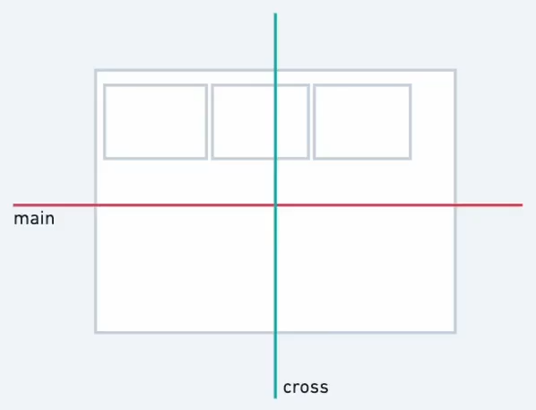
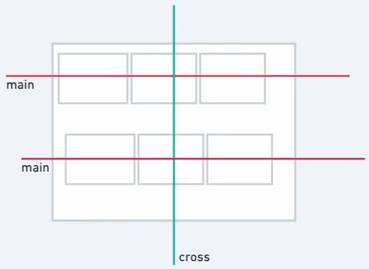

# 2. CSS Flexbox

### Links
- https://yoksel.github.io/flex-cheatsheet/
- https://css-tricks.com/snippets/css/a-guide-to-flexbox/
- https://www.youtube.com/watch?v=phWxA89Dy94&ab_channel=SlayingTheDragon

## Container, Itens e Eixo

O Flexbox é um modelo de layout simples que envolve um container e itens dentro dele.

Ao aplicar o `display: flex`, os itens são organizados lado a lado no eixo cruzado. É importante entender os conceitos de eixo principal e cruzado para posicionar os elementos corretamente.

A propriedade `flex-direction` permite alterar a direção dos elementos no eixo, com opções como `row`, `column` e `reverse`. Essas mudanças afetam a ordem e a posição dos elementos no layout.

- **ROW:**
    
    
    

## Justify-Content (default: `Flex-Start`)

Destaquei a propriedade `Justify-Content`, que controla o alinhamento dos elementos ao longo do eixo principal. Abordei os valores padrão, como `Flex-Start` e `Flex-End`, e outras opções como `Space-Evenly`, `Space-Around` e `Space-Between`. Também mencionei a importância de definir a altura dos elementos ao inverter o eixo. O `Justify-Content` é fundamental para distribuir os elementos de forma eficiente no layout.

## Align-Items (default: `Stretch`)

Neste trecho, foi abordado o alinhamento dos itens no eixo cruzado em um layout flexbox. Foi explicado sobre as opções de alinhamento como `Flex-Start`, `Center`, `Flex-End` e `Baseline`, mostrando como cada uma afeta a posição dos elementos. Também foi mencionado o conceito de "`Stretch`" e como ele se comporta no eixo cruzado.

## Gap e Margin

Neste trecho, expliquei como trabalhar com o espaçamento entre elementos usando a propriedade Gap, que pode ser definida em unidades fixas, relativas ou flexíveis. Também abordei o uso da propriedade Margin, incluindo o Margin automático, que empurra os elementos para alinhar à esquerda, à direita ou ao centro. O Margin automático é útil para ajustar o espaçamento e o alinhamento dos elementos de forma prática e eficiente.

## Multi Line usando o Flex-wrap

Ao aplicar o `flex-wrap`, novos containers são criados a cada nova linha, facilitando a organização dos elementos.

Demonstrei como os elementos se ajustam automaticamente quando ultrapassam o tamanho do container, e como o `flex-wrap` pode ser combinado com o `align-content` para alinhar os elementos de diferentes maneiras, como `center`, `flex-start` e `flex-end`.

- **WRAP:**
    
    
    

## Flex-Basis

O sizing no CSS é essencial para definir tamanhos e capacidades dos itens em um layout.

O `flex-basis` é semelhante à largura, mas se adapta ao eixo principal.

É importante considerar a inversão do eixo (row ou column) ao definir os tamanhos. O valor padrão pode ser ajustado com base em porcentagem, pixels ou outras unidades.

O `Flex-Grow` e `Flex-Shrink` também influenciam na adaptação dos itens. Entender essas propriedades é fundamental para criar layouts flexíveis e responsivos.

## Flex-Grow e Flex-Shrink

> Se `Flex-Grow` = 0 e `Flex-Shrink` = 0, quer dizer que estão desativados. Já acima de 0, estão ativados.

O `Flex-Grow` é responsável pelo crescimento automático dos itens e sua distribuição conforme os espaços vazios. Ao aplicar um valor maior que 1, o item cresce mais em relação aos outros. (default = 0)

Já o `Flex-Shrink` controla o encolhimento automático dos itens. Um valor maior que 1 fará com que o item encolha mais. (default = 1)

O alinhamento dos itens pode ser afetado pelo uso do `Flex-Basis` e do `Stretch`, especialmente em casos de inversão de eixo. Pequenos detalhes podem causar bugs devido à sensibilidade do CSS.

## Flex shorthand

The `flex` property is a shorthand property for the `flex-grow`, `flex-shrink`, and `flex-basis` properties.

- Flex: {grow} {shrink} {basis}
- Flex: {2} {7} {100px}
- Flex:
    - auto (1 1 auto)
    - none (0 0 auto)

## Order

A ordenação de elementos no HTML pode ser feita através da propriedade `order` no CSS. Essa propriedade permite definir a ordem visual dos elementos, sem modificar a estrutura do HTML.

É importante ter cuidado ao utilizar essa propriedade, pois pode afetar a acessibilidade e a leitura sequencial dos elementos por leitores de tela. O valor da propriedade `order` pode ser positivo, negativo ou zero, influenciando a posição dos elementos na página. É fundamental compreender o impacto dessa propriedade na estrutura da aplicação.

## Revisão e Propriedades Extras Flex-Flow, Align-Items, Row e Column-Gap e Align-Self

Neste vídeo, abordei conceitos essenciais de flexbox, como display, flex-flow, gap, justify-content, align-items, align-content, flex, flex-row, flex-shrink, flex-bases e align-self. Destaquei a importância de compreender o eixo principal e cruzado, direcionamento, alinhamentos, espaços, ordem, multilinha e tamanhos dos elementos. Expliquei as propriedades aplicadas em containers e filhos, enfatizando a funcionalidade do flexbox.