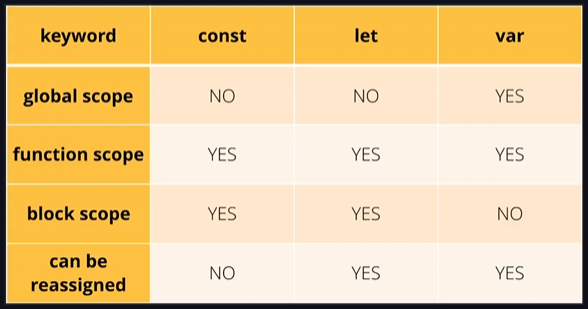

# 5.1 Javascript Básico

## Primeiros passos

### **Conhecendo o Javascript**

Nesta aula, foi abordado o conceito de JavaScript como uma linguagem de programação utilizada para adicionar interatividade e funcionalidades em páginas web.

O JavaScript é executado no navegador(lado) do usuário, sendo conhecido como client-side. Além disso, o JavaScript permite acessar e manipular elementos HTML, identificar interações do usuário e se comunicar com servidores.

A princípio foi criado para ser executado e interpretada pelo navegador. Atualmente, o JavaScript é utilizado não apenas em aplicações web, mas também em desenvolvimento de aplicações desktop, mobile, API e back-end. É importante diferenciar JavaScript de Java.

### **Alternativas para executar Javascript**

Nesta aula, são apresentadas alternativas para executar código JavaScript, como o JavaScript Playground e o CodePen, que permitem escrever e visualizar o resultado do código no navegador. Também é mencionado o uso do console do navegador para executar JavaScript. Recomenda-se o uso do Visual Studio Code para escrever o código JavaScript durante as aulas.

- https://www.jsplayground.dev/

### **Conectando Javascript**

Nesta aula, foram apresentadas diferentes maneiras de conectar HTML com JavaScript. Foi mostrado como inserir o código JavaScript diretamente no arquivo HTML, a importância de separar o código em arquivos externos e a recomendação de colocar o script no final do body para garantir um carregamento mais eficiente da página. Foi ressaltado que, embora seja possível inserir o script no head, não é recomendado devido ao impacto no carregamento da página.

## Variáveis e constantes

### **Hoisting**

[JavaScript Hoisting](https://www.w3schools.com/js/js_hoisting.asp)



Nesta aula, abordamos o conceito de hoisting em JavaScript. Hoisting permite que variáveis e funções sejam utilizadas antes de serem declaradas, pois o JavaScript move suas declarações para o topo do escopo. 

- `var` é a única palavra-chave que permite com que o interpretador do JS faça o hoisting.

Variáveis declaradas com var têm escopo global, enquanto let e const têm escopo de função e de bloco, proporcionando um controle mais preciso. Recomenda-se o uso de let e const em vez de var devido a desvantagens como falta de escopo de bloco adequado. A prática é essencial para compreender esses conceitos.

### **String**

Nesta aula, focamos no tipo String para armazenar texto em JavaScript. Expliquei como criar variáveis do tipo String, usar aspas simples e duplas, e também o uso do acento grave para permitir múltiplas linhas e formatação. Destaquei a diferença entre as formas de definir conteúdo de texto e quando usar cada uma delas. Essas estratégias são essenciais para lidar com dados de texto de forma eficiente em JavaScript.

**Template Strings**

```jsx
console.log("Hello World")

console.log(`
    asd
    "asd"
    'asd'
    asd
`)
```

### **Template Literals**

```jsx
let username = "Thales"

console.log("Olá, ${username}. Tudo bem?")
```

### **Conversão e Coerção de Tipos**

Nesta aula, abordamos a conversão de tipos e a coerção de tipos em JavaScript. A conversão de tipos envolve transformar um valor de um tipo para outro de forma consciente, utilizando o typecasting. Já a coerção de tipos ocorre de forma automática, quando o JavaScript tenta converter valores para um tipo compatível antes de realizar uma operação. Exemplos práticos foram mostrados, como a conversão de números para strings e vice-versa, e a coerção de tipos em operações matemáticas. É importante entender a diferença entre esses dois conceitos ao programar em JavaScript.

## Operadores

### **Estritamente Igual e Diferente**

Nesta aula, expliquei sobre os operadores de comparação estritamente igual a (===) e estritamente diferente de (!==) em JavaScript. O operador estritamente igual a compara tanto o valor quanto o tipo das variáveis, enquanto o estritamente diferente de faz o mesmo, mas retorna verdadeiro se os tipos forem diferentes. Recomendei o uso desses operadores para garantir comparações precisas, especialmente ao lidar com diferentes tipos de dados, evitando erros comuns, como concatenar em vez de somar valores.

## **Condicionais**

### **Falsy e Truthy**

Nesta aula, expliquei a diferença entre valores falsos e verdadeiros em JavaScript. Valores como zero, texto vazio, nulo e undefined são considerados falsos, enquanto valores como objetos vazios, arrays vazios, números inteiros diferentes de zero e textos não vazios são considerados verdadeiros. Compreender essas distinções é fundamental para trabalhar com condicionais e loops de forma eficaz.

[JavaScript Booleans](https://www.w3schools.com/js/js_booleans.asp)

### **Try / Catch / Finally**

Nesta aula, foi demonstrado o uso do tratamento de exceções na prática. Foi mostrado como utilizar os blocos try, catch e finally para lidar com erros de forma mais amigável. Foi exemplificado como capturar e exibir mensagens de erro personalizadas, além de lançar exceções personalizadas. O bloco finally foi apresentado como uma forma de executar instruções independentemente do resultado. O uso do try-catch é essencial no desenvolvimento de aplicações para lidar com erros de forma eficiente e amigável.

```jsx
let age = 0

try {
  if(age < 1) {
    throw new Error("Valor inválido!")
  }
} catch (erro) {
  console.log("Erro: " + erro)
} finally {
  console.log("FIM")  
}

/*
Erro: Error: Valor inválido! 
FIM 
*/
```

## **Funções**

### **Argumentos e Parâmetros**

Os parâmetros são variáveis que a função recebe, enquanto os argumentos são os valores passados para a função.

```jsx
// Parâmetros
function soma(a, b) {
  console.log("Resultado:", a + b)
}

// Argumentos
soma(10, 5)
soma(1, 2)
```

### **Retornando valores**

```jsx
function soma(a, b) {
  let result = a + b

  return result
}

let response = soma(10, 5)
console.log("Resultado:", response)
```

### **Comentário de Documentação**

Nesta aula, foi abordado o uso de comentários de documentação, seguindo o padrão JSDoc, para explicar detalhes das funções no código-fonte. Foi exemplificado como criar esses comentários para descrever parâmetros, retornos e funcionalidades das funções, facilitando o entendimento e uso por outros desenvolvedores. A importância de detalhar os parâmetros, tipos de dados aceitos e retornos foi destacada, mostrando como esses comentários podem enriquecer a documentação do código

```jsx
/**
 * User Authentication
 * 
 * @param {String} email user email.
 * @param {String} password more than 5 characters.
 * @returns {Number} user id.
 */
function signIn(email, password) {

    return 10
}

signIn("nome@email.com", "123456")
```

### **Função Anônima**

Nesta aula, expliquei como criar funções anônimas em JavaScript, que são funções sem nome geralmente armazenadas em variáveis para uso imediato. Mostrei como criar e utilizar uma função anônima, passando parâmetros e armazenando a própria função em uma variável. Demonstrei como executar a função anônima e como passar parâmetros para ela. Expliquei a sintaxe para passar múltiplos parâmetros em uma função anônima.

```jsx
const showMessage1 = function() {
    return "Olá"
}
console.log(showMessage1())

const showMessage2 = function(username) {
    console.log("Olá", username)
}
showMessage2("Thales")
```

### **Arrow Function**

Nesta aula, foi abordada a Arrow Function em JavaScript, uma forma mais concisa de escrever funções anônimas. Foi mostrado como criar e armazenar uma Arrow Function em uma variável, além de passar parâmetros para ela. A interpolação de strings também foi mencionada como uma forma mais legível de concatenar valores. A Arrow Function não requer a palavra-chave "function" e permite uma sintaxe mais enxuta e elegante para funções em JavaScript.

```jsx
const showMessage1 = () => {
    return "Olá"
}
console.log(showMessage1())

const showMessage2 = (username) => {
    console.log("Olá", username)
}
showMessage2("Thales")
```

### **Callback Function**

Neste vídeo, expliquei como passar uma função como argumento para outra função, chamada de callback function. Mostrei na prática como criar e executar essa função dentro de outra função. Também demonstrei a possibilidade de criar a função diretamente no parâmetro da função, utilizando uma função anônima ou uma Arrow Function. Além disso, destaquei a forma simplificada de executar uma única instrução sem a necessidade de abrir e fechar chaves. Essas são algumas das diversas possibilidades ao trabalhar com funções de callback

```jsx
function execute(taskName, callback) {
    console.log("Tarefa:", taskName)
  
    callback()
}

// #1: Passando uma função como callback
function myCallback() {
    console.log("Tarefa concluída!")
}
execute("Download...", myCallback)

// #2: Função anônima como callback
execute("Upload...", function() {
    console.log("Tarefa concluída!")
    }
)

// #3: Função Arrow como callback
execute("Saving...", () => {
    console.log("Tarefa concluída!")
    }
)

// OU de forma curta
execute("Deleting...", () => console.log("Tarefa concluída!"))
```

## Document Object Model (DOM)

O DOM é uma estrutura essencial manipulada com JavaScript para representar objetos em uma página web. É organizado em uma estrutura de árvore, onde elementos HTML são representados como nós e objetos. A aula destaca a relação entre os elementos HTML e a estrutura do DOM, mostrando como acessar e modificar esses elementos.

### Acessando elementos + **Query Selector**

```jsx
console.log(document)
console.log(document.title)

// --- By ID
const guest = document.getElementById("guest-1")
console.log(guest)

// --- propriedades do objeto
console.dir(guest)

// --- By Class
const guests = document.getElementsByClassName("guest")

console.log(guests.item(0))
console.log(guests[0])

// --- By Tag
const guestByTag = document.getElementsByTagName("li")
console.log(guestByTag[0])

// --- Query Selector
const guestOne = document.querySelector("#guest-1")
const guestsOne = document.querySelector(".guest")
const guestsAll = document.querySelectorAll(".guest")
```

### Manipulando Conteúdo

```jsx
// --- Texto
const guestOne = document.querySelector("#guest-1 span")
console.log(guestOne.textContent)
guestOne.textContent = "Maria"
console.log(guestOne.textContent)

const guestTwo = document.querySelector("#guest-2")
console.log(guestTwo.textContent) //Retorna o conteúdo visível e oculto
console.log(guestTwo.innerText) //Retorna somente o conteúdo visível
console.log(guestTwo.innerHTML) //Retorna o HTML como texto
```

### **Alterando Estilos**

```jsx
// --- adição e remoção de classe
const input = document.querySelector("#name")

input.classList.add("input-error")
input.classList.remove("input-error")
input.classList.toggle("input-error")
console.log(input);

// --- Modificar css do elemento
const button = document.querySelector("button")

button.style.backgroundColor = "red"
```

### **Criando Elementos**

```jsx
const guests = document.querySelector("ul")
const newGuest = document.createElement("li")

// console.log(guests.innerHTML)

const guestName = document.createElement("span")
guestName.textContent = "Didi"

const guestLastName = document.createElement("span")
guestLastName.textContent = "Mocó"

// --- adiciona antes
newGuest.prepend(guestName)
// --- adiciona após
newGuest.append(guestLastName)
// --- outros formas
// newGuest.append(guestName, guestLastName)
// newGuest.appendChild(guestName)

console.log(newGuest.innerHTML)

// --- inserir na lista de fato
newGuest.classList.add("guest") // adiciona o estilo do .css
guests.prepend(newGuest)

console.log(guests.innerHTML)
```

### **Manipulando Atributos**

```jsx
const input = document.querySelector("input")

input.setAttribute("type", "checkbox")
input.setAttribute("disabled", true)
input.removeAttribute("id")
```

### **Eventos**

```jsx
// #1
window.addEventListener("load", () => {
    console.log("Página carregada!")
})

// #2
addEventListener("click", (evento) => {
    // --- submit não irá recarregar a página
    evento.preventDefault()

    // --- Retorna todas as informações do evento
    console.log(evento)

    // --- Retorna o elemento clicado
    console.log(evento.target)

    // --- Retorna o textContent do elemento clicado
    console.log(evento.target.textContent)
})
```

### **Eventos em um elemento específico**

Nesta aula, aprendemos a identificar eventos em elementos específicos em JavaScript. Foi mostrado como observar o evento de scroll em uma lista, exibindo informações como a distância do topo da lista. Também foi demonstrado como manipular o scroll, levando o usuário de volta ao topo da lista. Além disso, vimos como adicionar eventos de clique em botões específicos. A importância de desabilitar o comportamento padrão do evento de clique também foi destacada.

```jsx
const ul = document.querySelector("ul")

ul.addEventListener("scroll", () => {
    // distância que a barra tá do topo da lista
    console.log(ul.scrollTop)

    if(ul.scrollTop >= 300) {
        console.log("Fim da lista!")
        
        ul.scrollTo({
            top: 0,
            behavior: "smooth"
        })
    }
})

const button = document.querySelector("button")
button.addEventListener("click", (evento) => {
    evento.preventDefault()
    console.log("Clicou!")
})
```

### **Eventos de formulário**

Nesta aula, focamos nos eventos de formulário, mostrando como selecionar um formulário e lidar com eventos como OnSubmit. Expliquei a diferença entre usar OnSubmit diretamente e addEventListener, destacando que OnSubmit considera apenas o último listener criado, enquanto addEventListener executa todos. Demonstrei na prática como isso afeta o comportamento dos eventos.

```jsx
const form = document.querySelector("form")

form.onsubmit = (evento) => {
    evento.preventDefault()

    console.log("Submit #1")
}

form.addEventListener("submit", (evento) => {
    evento.preventDefault()

    console.log("Submit #2")
})
```

### **Eventos em input**

```jsx
const input = document.querySelector("input")

// Quando qualquer tecla é pressionada
input.addEventListener("keydown", (evento) => {
    console.log(evento.key)
})

// Quando qualquer caractere é pressionada
input.addEventListener("keypress", (evento) => {
    console.log(evento.key)
})

input.onchange = () => {
    console.log("INPUT MUDOU!")
}
```

## **Compreendendo Expressão Regular**

- https://regexr.com/

Nesta aula, expliquei o conceito de expressões regulares, que são usadas para identificar padrões em strings, como validar um e-mail. Mostrei um exemplo de expressão para verificar letras em um texto. Expliquei o uso do sinal de mais para encontrar sequências de caracteres e do modificador global para fazer correspondências em toda a string. Enfatizei que não é necessário decorar as combinações, mas entender a possibilidade de validação com expressões regulares, também conhecidas como regex.

- Exemplo:
    
    
    

### **Manipulando valor do input**

```jsx
const input = document.querySelector("input")
const form = document.querySelector("form")

input.addEventListener("input", () => {
    // console.log(input.value)
    
    // --- Padrão regex: Apenas letras
    const regex = /\D+/g
    const valor = input.value
    
    // --- Retorna o padrão encontrado na string
    console.log(valor.match(regex))

    // --- Testa se o padrão é válido
    const isValid = regex.test(valor)
    console.log(isValid)
})

/* form.addEventListener("submit", (evento) => {
    evento.preventDefault()

    // --- Padrão regex: Apenas letras
    const regex = /\D+/g

    // --- Substitui o padrão, por vazio
    const valor = input.value.replace(regex, "")

    console.log(valor)
}) */
```

## **Depuração de código (debug)**

- **O que é depurar o código?**
    
    Nesta aula, abordamos a depuração de código, também conhecida como debug. Expliquei que é o processo de encontrar e corrigir erros, os famosos bugs. Destaquei a importância de usar breakpoints para pausar a execução do programa e inspecionar variáveis e fluxos de execução. Inspecionar é examinar o código para entender a lógica e identificar problemas. A depuração é essencial para encontrar e corrigir erros em um projeto, permitindo uma análise detalhada do código
    

```jsx
const input = document.querySelector("input")
const form = document.querySelector("form")

form.onsubmit = (evento) => {
    evento.preventDefault()
	
    const valor = input.value
    
    // --- Padrão regex: Apenas dígitos
    const regexNumber = /\d+/g
    
    if(regexNumber.test(valor)) {
		alert("Inválido. o texto contém números!")
    } else {
		alert("Enviado!")
    }
}
```