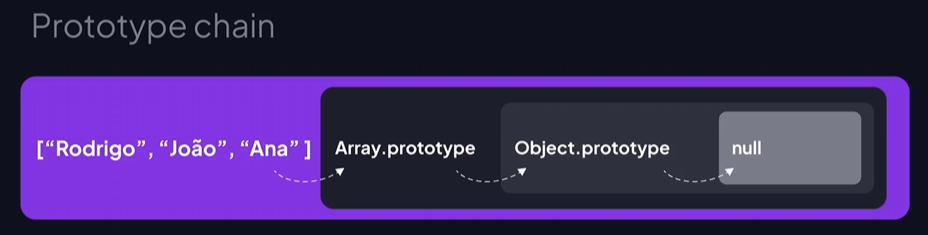

# **Classes**

## **Aprendendo sobre classes**

Nesta aula, vamos aprender o conceito de classes em JavaScript, introduzido no ECMAScript 2015.

As classes têm construtores e métodos, permitindo a criação de modelos para objetos. Além disso, as classes possibilitam a herança de propriedades e métodos de outras classes, promovendo a reutilização de código.

- Elas oferecem uma sintaxe mais amigável para criar objetos e herdar protótipos, conhecida como **"syntax sugar"**.

## **Criando uma classe com um método construtor**

Nesta aula, aprenderemos a criar uma classe em JavaScript, utilizando a palavra reservada `class` seguida do nome da classe no padrão Paschal Case. Iremos definir o corpo da classe e criar um construtor, que é uma função especial executada automaticamente ao instanciar a classe.

```jsx
class Person {
    constructor(name) {
        console.log("Teste", name)
    }
}

const person01 = new Person("Thales")
```

## **Criando propriedades dentro das classes**

Nesta aula, vamos aprender um pouco mais sobre o uso do `this` em classes em JavaScript, mostrando como criar propriedades e acessá-las.

```jsx
class Product {
    constructor(name) {
        this.name = name
    }
}

const product01 = new Product("Teclado")
console.log(product01.name)

const product02 = new Product("Mouse")
console.log(product02.name)
```

## **Adicionando métodos nas classes**

Veremos que não é necessário usar a palavra-chave `function` ao definir um método dentro de uma classe.

```jsx
class User {
    constructor(name, email) {
        this.name = name
        this.email = email
    }

    sendEmail() {
        console.log("USUÁRIO:", this.name, "EMAIL:", this.email)
    }
}

const user = new User("Thales", "thales@mail.com")
user.sendEmail()
```

## **O que é método estático?**

Vamos ver como criar e utilizar um método estático em uma classe, destacando a diferença de acesso entre métodos estáticos e não estáticos. Demonstraremos que métodos estáticos podem ser acessados sem a necessidade de instanciar a classe, enquanto métodos não estáticos requerem a instanciação da classe.

```jsx
class User {
    static msg01() {
        console.log("Menssagem 1")
    }
    
    msg02() {
        console.log("Menssagem 2")
    }
}

User.msg01() // = Menssagem 1
User.msg02() // Uncaught TypeError: User.msg02 is not a function
```

## **Como aplicar herança com classes?**

A herança permite reutilizar propriedades e métodos de classes superiores.

```jsx
class Animal {
    constructor(name) {
        this.name = name
    }

    sound() {
        console.log("Som genérico")
    }
}

class Animal01 extends Animal {
    // EMPTY
}
const animal = new Animal01()
// Método Herdado
animal.sound() // = Som genérico

// Sobrescrevendo métodos

class Dog extends Animal {
    sound() {
        console.log("Aw... Aw...")
    }
}

const dog = new Dog("Spike")
console.log(dog.name) // = Spike 
dog.sound() // = Aw... Aw... 
```

## **Aprendendo sobre herança e cadeia de protótipos**

Nesta aula, vamos aprender o conceito de prototype chain no JavaScript, que se baseia em herança e cadeia de protótipos. Vamos entender como objetos **herdam propriedades e métodos de seus protótipos ascendentes**, até chegar a um protótipo com valor nulo, finalizando a cadeia.



## **Criando um objeto prototype**

Nesta aula, exploraremos a herança de objetos em JavaScript, demonstrando na prática o uso do prototype. Vamos aprender como objetos como endereço e arrays possuem protótipos que podem ser explorados para entender a cadeia de herança. Compreender essa estrutura de herança em JavaScript é fundamental para aprofundar seus conhecimentos na linguagem.

```jsx
const obj = {id: 1, valor: "asd"}
const vet = ["asd", "qwe"]
const txt = "asd"

console.log(obj.__proto__)
console.log(vet.__proto__)
console.log(txt.__proto__)
```

## **Como utilizar classes pra lidar com exceções**

Nesta aula, aprenderemos a utilizar classes para lidar com exceções específicas em JavaScript. Vamos ver como identificar e tratar diferentes tipos de erros, como TypeError e RangeError. Também foi abordado o uso do método `throwNew` para gerar exceções personalizadas. Vamos mostrar a importância de tratar exceções de forma específica e amigável para o usuário, assim como a possibilidade de encadear diferentes tipos de exceções.

```jsx
let vet = []
let index = 100

try {
    // #1
    //vet.execute()

    // #2
    // if (!vet.includes(1)) {
    //     throw new Error("Número 1 indisponível")
    // }

    // #3
    if (index > 99) {
        throw new RangeError("Número acima do intervalo")
    }

} catch (error) {
    if (error instanceof TypeError) {
        console.log("Método indisponível")
    } else if (error instanceof RangeError) {
        console.log(error.message)
    } else {
        console.log(error) // Número 1 indisponível
    }
}
```