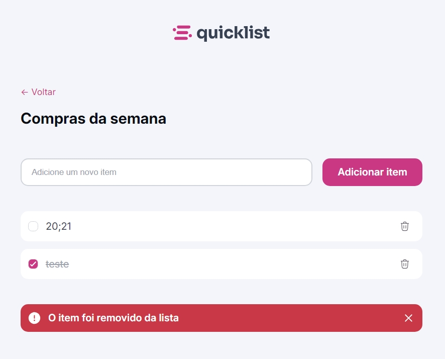
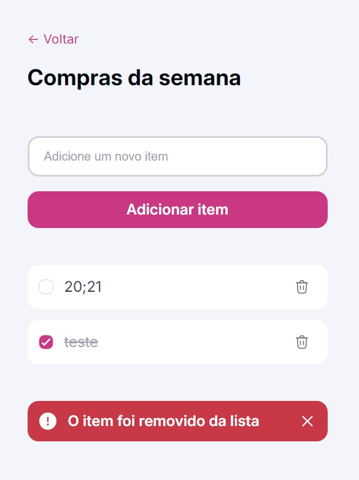

# Quicklist - App de Lista

**Site responsivo de lista de compras onde o usuário pode gerenciar os itens adicionando e removendo eles.**

- Este projeto faz parte da [Formação Full Stack](https://github.com/thalesamaral/Rocketseat-Full_Stack/tree/main) da [Rocketseat](https://www.rocketseat.com.br/)
- Implementação: https://thalesamaral.github.io/Rocketseat-Full_Stack/02-Nivel/02-Desafio-Quicklist

#### **Desafio prático**

> Chegou a hora de aplicar toda a teoria que você aprendeu até aqui colocando a mão na massa! Este é o momento de transformar conhecimento em ação, desenvolvendo um projeto que vai consolidar suas habilidades e te preparar um pouco mais para os desafios reais!

## ✨ Recursos Aprendidos e em Destaque

**Fundamentos de Javascript**
- Document Object Model (DOM)
- Functions
- Events
- Arrays e Métodos de Manipulação
- JSON: `stringify()`; `parse()`;
- Template Literals (Template Strings)

**Conceitos**
- CRUD (Create, Read, Update, Delete)
- Armazenamento Local (Local Storage)
- Manipulando conteúdo e atributos
- Acessando e criando elementos
- Adição e remoção de classe

## 💻 Tecnologias usadas

- HTML
- CSS
- JAVASCRIPT

## 📝 Como executar o projeto

1. Clone o repositório para sua máquina local.
2. Abra o arquivo `index.html` em seu navegador da web.

## ✏️ Design

- [Figma](https://www.figma.com/community/file/1397279978314668489).
- Design feito por [Rocketseat](https://www.rocketseat.com.br/).

## 👀 Preview

### Desktop

### Mobile

# 👨‍💻 Autor

### Thales Amaral Lima
Graduando em Ciência da Computação com foco em full stack, apaixonado por entregar soluções tecnológicas com a melhor experiência do usuário.
Sinta-se à vontade para me seguir no GitHub e entrar em contato comigo no LinkedIn.

## Contato

### [**Thales Amaral Lima**](https://github.com/thalesamaral)

🛠 `Frontend` Developer  
📍 Brasília - Brasil

&nbsp;&nbsp;&nbsp;&nbsp; 